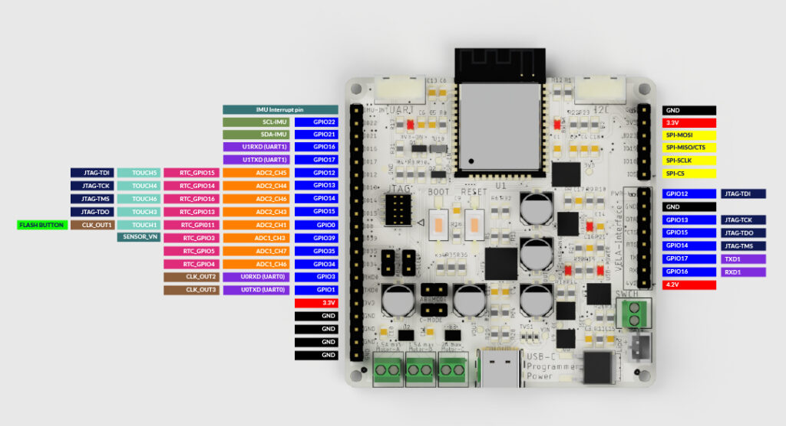
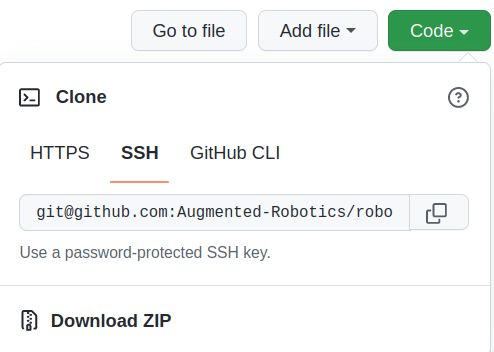

## RoboHeart Library
Library for the [RoboHeart Hercules Board](https://roboheart.de). 

Highlight of the board features:
- ESP32 microcontroller
- IMU - MPU6050
- 1s Lipo Battery Full Support (charging, overcharge, overdischarge, usage as power source, reverse battery protection)
- Three DC motors control or One Stepper motor control
- JTAG connector Debugging
- USB-C connector with Auto-program feature
- Grove connectors for UART and I2C

### Board pinout



### Library Installation
1. Install MPU6050_light library through [Arduino Library Manager](https://docs.arduino.cc/software/ide-v1/tutorials/installing-libraries)

2. Install ESP32 Arduino as described in [Espressif page](https://docs.espressif.com/projects/arduino-esp32/en/latest/installing.html).

3. Further download RoboHeart library using Git manager or through the Download ZIP option in GitHub:  
    

4. Place folder or unpack it in the default Arduino library path:
    ```
    C:\Users\<Your_Username>\Documents\Arduino\libraries\       # For Windows users
    /home/<Your_Username>/Arduino/libraries/                    # For Ubuntu users
    ```

4. Now restart your Arduino environment. 

### Getting started

1. Chose the appropriate board in your Arduino environment: `Tools->Board->ESP32 Arduino->ESP32 Dev Module`
2. Open one of the built-in examples (scroll to the bottom of Examples):`File->Examples->RoboHeart->RoboHeartLED`
3. Connect the board with USB-C cable to your computer and press Upload in Arduino

### Feature or Issue reporting
Open a ticket in the [Issue board of the project](https://github.com/Augmented-Robotics/roboheart-arduino-library/issues). Please provide all relevant details (if you use any additional hardware, how you connect the board), usecases or situation the problem occured.


### Contributor guide
#### Formating
Google style for spacing, brackets, general code look. Check out the [google description](https://google.github.io/styleguide/cppguide.html#Classes). Auto-formater can be set up with vsCode:
1. Install C/C++ Extension
2. In vsCode Settings find: `Clang_format_fallback`
3. Replace with the following: ```{ BasedOnStyle: Google, IndentWidth: 4, TabWidth: 4, ColumnLimit: 80 }```
4. You can use the auto-format shortcut Ctrl+Shift+I (for Ubuntu)


For naming of variables, functions, classes follow [Arduino style guide for Libraries](https://docs.arduino.cc/learn/contributions/arduino-library-style-guide) 
